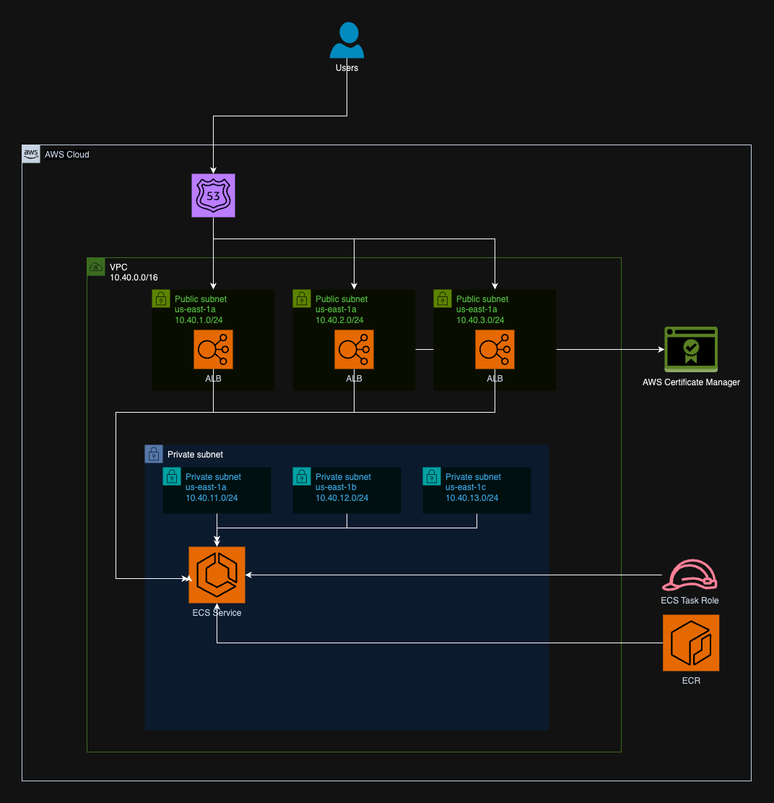

# Canoe
DevOps test

## Application

The provided Flask application serves as a simple API with three endpoints (`/hello`, `/current-time`, and `/healthcheck`). It responds to HTTP GET requests with JSON responses. The log_request() function logs details about each incoming request.

## Docker Image Build

Go to app folder and run `docker build -t <tag_name> .`

## Running Locally

Run `docker run -p 3000:3000 <tag_name>`

## How to tag the image and push it to ECR

Run this command to login to ECR
`aws ecr get-login-password --region <your-region> | docker login --username AWS --password-stdin <your-account-id>.dkr.ecr.<your-region>.amazonaws.com`

Run this command in the app folder `docker build -t <ecr-repository-name>:latest .`. That will build the image

This command will tag the image for you to push to ECR
`docker tag <ecr-repository-name>:latest <your-account-id>.dkr.ecr.<your-region>.amazonaws.com/<ecr-repository-name>:latest`

This command will push the docker image to ECR
`docker push <your-account-id>.dkr.ecr.<your-region>.amazonaws.com/<ecr-repository-name>:latest`

## Terraform Usage

Terraform has been setup in a way it can be reused for different environments if needed. This is achieved by using backend files and terraform workspaces. This setup is also usefull because generates separate state files, facilitating and speeding up the process of making changes to the infrastructure, because you don't need to apply all the code eveytime you need to make a change, it's a similar principle of how terragrunt manage the states.

The variables are configured inside the config folder, that means if we create different config files new environments will be created using the same code.

In this setup, to be able to start using terraform, the state bucket needs to be created, for that the code inside `terraform/init` folder must be executed before anything else with these commands:

0. Set your AWS credentials using you preffered method (e.g `export AWS_PROFILE=<your-profile-name>`)
1. `export TF_WORKSPACE=development`
2. `terraform init` or `task init-state-bucket`
3. `terraform plan` or `task plan-state-bucket`
4. `terraform apply` or `task apply-state-bucket`

To use this setup you can use these commands if you want to execute the code, it's important to follow this order to avoid unexpected errors:

0. Set your AWS credentials using you preffered method (e.g `export AWS_PROFILE=<your-profile-name>`)
1. `export TF_WORKSPACE=development`
2. `terraform init -backend-config=backend-"$TF_WORKSPACE".hcl`
3. `terraform plan -var-file=backend-"$TF_WORKSPACE".hcl`
4. `terraform apply -var-file=backend-"$TF_WORKSPACE".hcl`

As we are creating splitted state files for better management the order of the modules matter, specially if we are using dependencies from others. For this setup I removed any dependencies and that is one of the reasons the apply would not work, but anyways, make sure you follow this order to plan the modules:

1. VPC
2. ECR
3. ECS
4. ECS_SERVICE

To facilitate the process I created a Taskfile with automated tasks, if you run those tasks in this order you will be able to test the terraform code.

To run the taskfile please install task app first
* https://taskfile.dev/installation/
* On mac use: `brew install go-task/tap/go-task`

Tasks:

1. `task plan-state-bucket`
2. `task apply-state-bucket`
3. `task dev-init-all`
4. `task dev-plan-all`

**The apply is not fully working because would incur in charges on my account, a few tweaks would be needed in order to be able to apply.**

## Architecture Diagram

